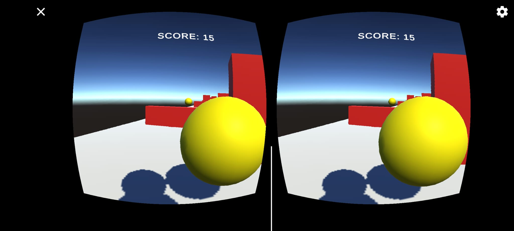
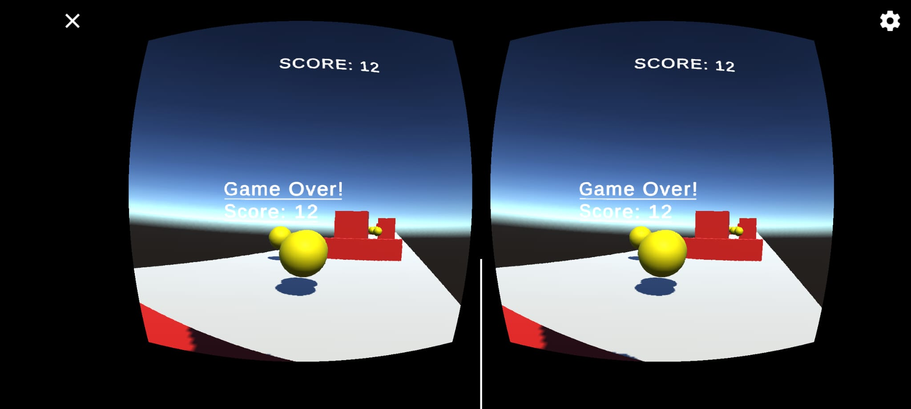

# Endless Runner in VR

A virtual reality endless runner game implemented in Unity using Google Cardboard. Players move forward automatically, using head tilts for lateral movement while collecting coins and avoiding obstacles.

## Screenshots

*Gameplay through Google Cardboard*

*Game over screen showing final score*

## Features

- Automatic forward movement with head-tilt controls
- Coin collection system
- Obstacle avoidance
- Procedurally generated environment
- Basic VR integration with Google Cardboard
- Score tracking
- Automatic game restart on collision

## Built With

- Unity Engine
- Google Cardboard SDK
- Unity's CharacterController for player movement
